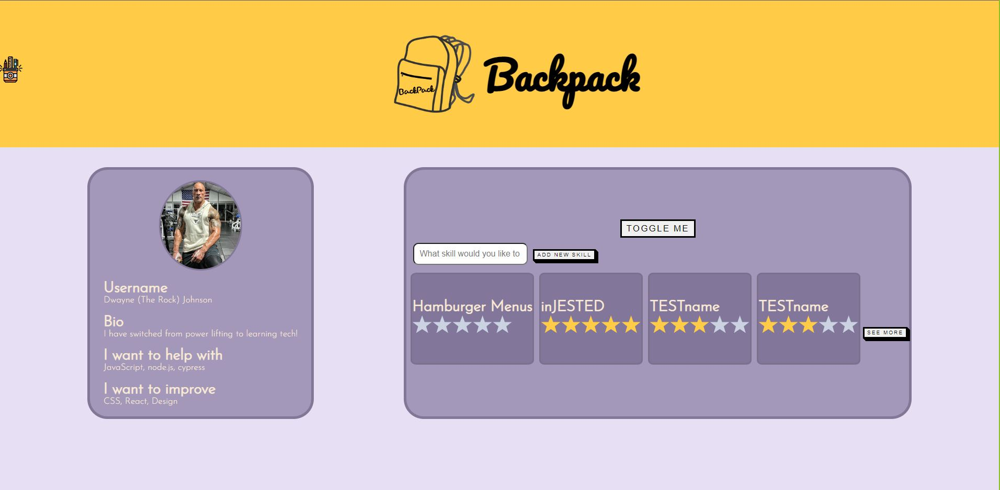
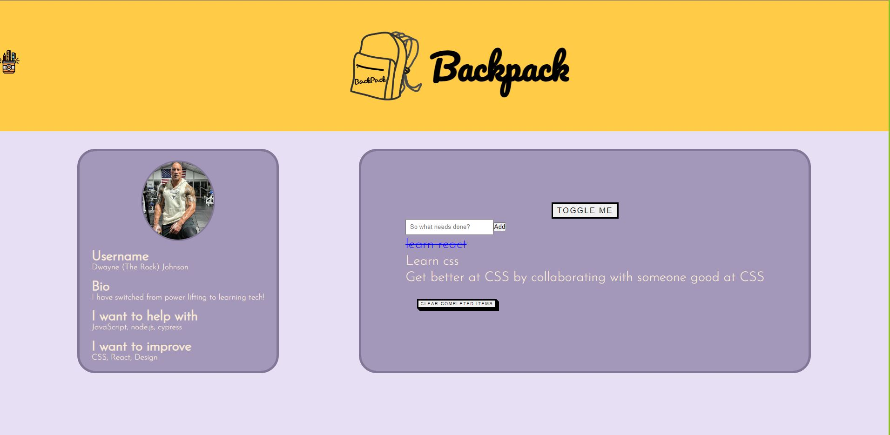

# Backpack - from Team.js

## Introduction

Backpack is an app that aims to support students learning to code - or learning any skill for that matter!

The general premise of the app is to help students to keep track of their development, by breaking down the topics into individual skills, as well as tools to assist in improving those skills.

This is currently the MVP for Backpack, V.1.0, and future releases will aim to include functionality such as:

- connecting with friends
- mental health support
- flashcard revision
- resource library
- user login and authentication

## Installation

Clone the two repositories (frontend and backend) down to your machine. Open up two terminals and use one to navigate to front end, and one to navigate to the back.

In both, enter the command to install dependancies:

Install with npm

### Frontend

```bash
cd w9_frontend-project-team-js/team-js
npm i
```

### Backend

```bash
cd w9_backend-project-team-js
npm i
```

Once the necessary nodes have been installed you can spin up the app! First open your backend terminal, and run the dev script:

### Backend

```bash
npm run dev
```

and once thats spinning round round baby right round you can open your Frontend terminal and start the react app 😊

### Frontend

```bash
npm start
```

Backpack will then start up in your browser, and you should be able to see the data pulled through from the database.

## Example



This is the default component currently displayed when you start the app. As you will see the data is pulled through from the database. Each skill has its own card, with an accompanying star rating. This is for the users to self-evaluate their abilities.

Users can enter new skills in the Skills Input field above. This will update the database when the button is clicked.

To navigate to the Goals component, the user clicks the Toggle Me button at the top.



The Goals component is straight forward, as it stands just a simple To Do list. There is functionality for the user to strike through completed goals by clicking them. When the time comes, they can then remove all striked goalsd by clicking the Clear button at the bottom.

This functionality is persistent and will update the database accordingly.
